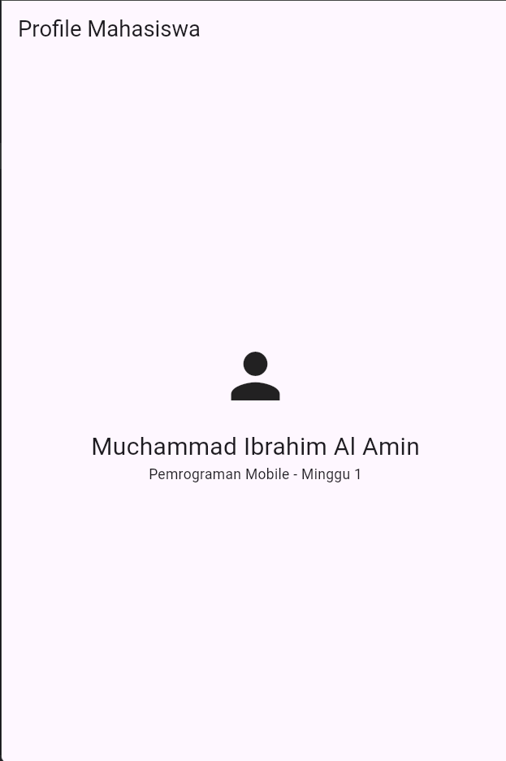

# Tugas Minggu 1: Mobile Development Ecosystem & Flutter Refresh

**Nama:** Muchammad Ibrahim Al Amin  
**NIM:** 244107020062  
**Mata Kuliah:** Pemrograman Mobile  
**Kelas / Semester:** Semester 5  

---

## 1. Deskripsi Tugas
Praktikum Minggu 1 ini berfokus pada pengenalan ekosistem pengembangan aplikasi mobile modern, perbandingan pendekatan *native*, *hybrid*, dan *cross-platform* (Flutter), pemahaman widget tree serta dasar bahasa Dart. Tugas praktikum ini mencakup inisialisasi lingkungan kerja Flutter dan pembuatan aplikasi sederhana **Profil Mahasiswa** menggunakan widget dasar Flutter.

---

## 2. Fitur Utama Aplikasi
- **AppBar:** Menampilkan judul "Profile Mahasiswa".
- **Avatar Profil:** Menggunakan ikon `Icons.person` berukuran besar.
- **Identitas Mahasiswa:** Menampilkan Nama Lengkap, NIM (`244107020062`), dan keterangan kelas/praktikum.
- **Dekorasi & Tata Letak:** Menggunakan `Center` dan `Column` untuk penataan widget yang rapi di tengah layar.

---

## 3. Hasil Tangkapan Layar (Screenshot)
Berikut adalah hasil tangkapan layar eksekusi aplikasi pada emulator / device:



---

## 4. Kendala Setup & Solusi
- **Kendala yang Ditemui:**
  Saat pertama kali menjalankan `flutter doctor`, muncul peringatan bahwa beberapa lisensi Android SDK belum diterima (*Android toolchain - some Android licenses not accepted*).
- **Solusi yang Diterapkan:**
  Menjalankan perintah `flutter doctor --android-licenses` di terminal, lalu mengetikkan `y` untuk menyetujui seluruh ketentuan lisensi Android SDK. Setelah proses selesai dan `flutter doctor` dijalankan kembali, seluruh komponen Android toolchain telah terverifikasi dengan centang hijau (*ready*).

---

## 5. Cara Menjalankan Aplikasi
1. Arahkan terminal ke folder proyek:
   ```bash
   cd 01-week-1-mobile-development-ecosystem-flutter-refresh
   ```
2. Pasang dependensi:
   ```bash
   flutter pub get
   ```
3. Jalankan aplikasi:
   ```bash
   flutter run
   ```
