**Warm Up**
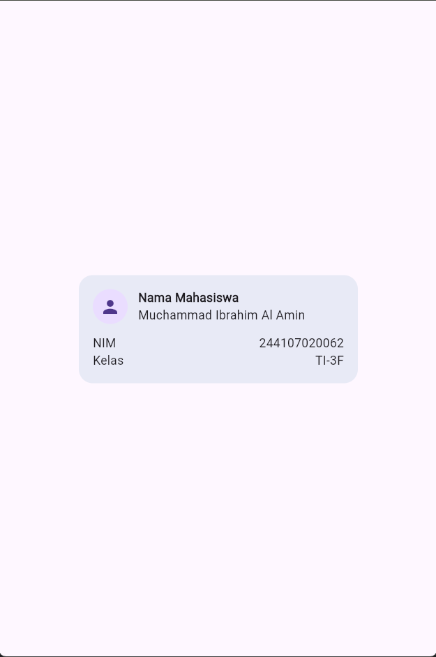
1. Hapus Expanded pada baris nama, lalu amati peringatan overflow atau perilaku layout-nya; kembalikan setelah itu.
  - pada code mendapatkan error, tetapi di bagian tampilan sama aja karena text tidak terlalu panjang jika terlalu panjang maka akan keluar dari card
2. Ganti mainAxisSize: MainAxisSize.min menjadi nilai default dan amati perubahan tinggi kartu.
  - yang terjadi yaitu ukuran card vertical menjadi semaksimal mungkin
  - 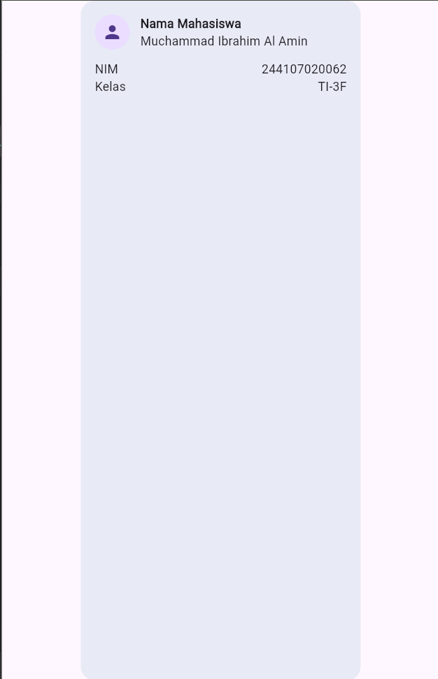
3. Tambahkan satu baris data (misal Email) menggunakan pola Row + Expanded yang sama.
  - 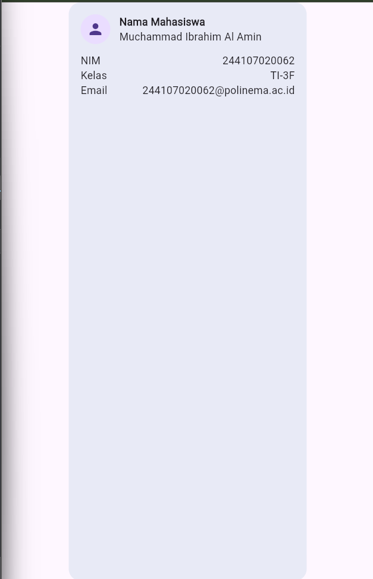

**Praktikum: dashboard responsif**
1. 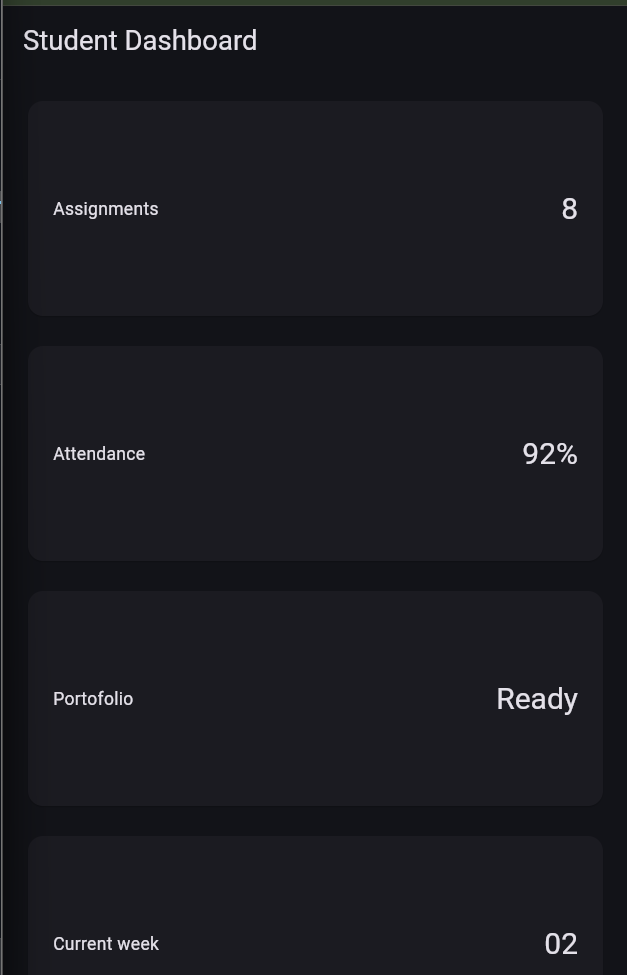
2. Menambahkan interaksi: StatefulWidget dan Cupertino
  - 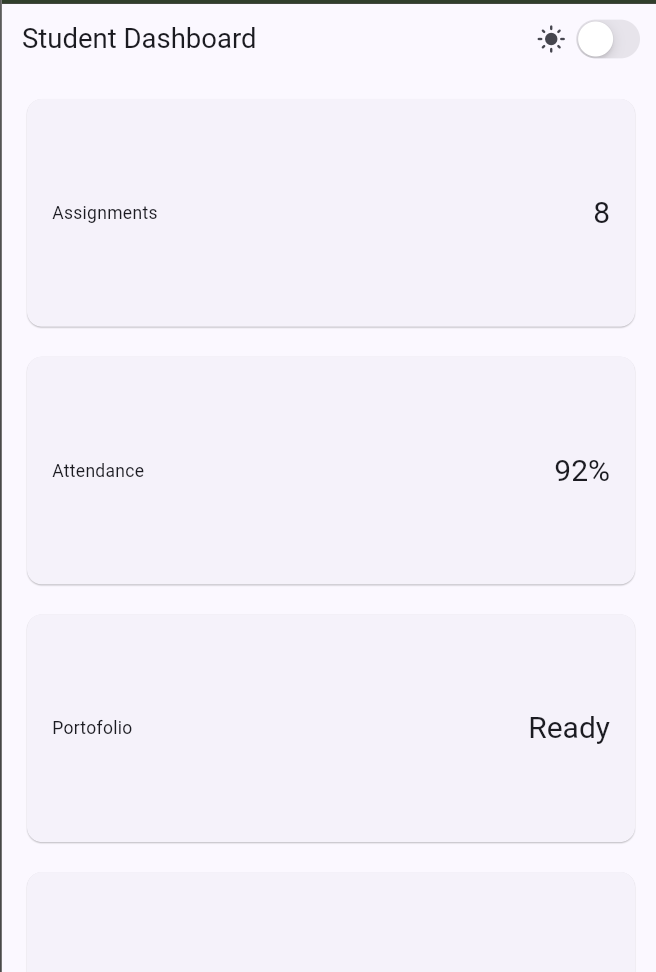 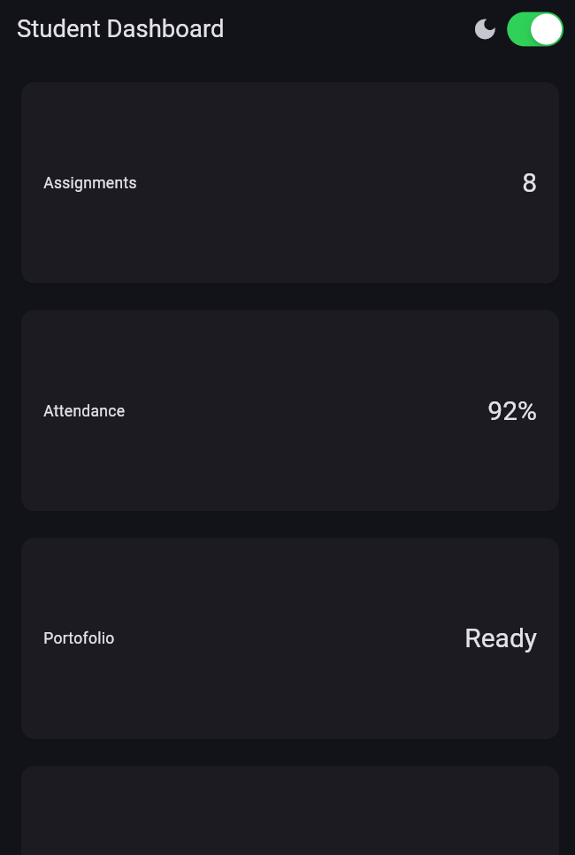

**Eksperimen layout**
1. Ubah breakpoint dari 700 menjadi nilai lain dan amati perubahan jumlah kolom.
- saya ubah ke 500 card mengecil dan mengisi column yang kosong 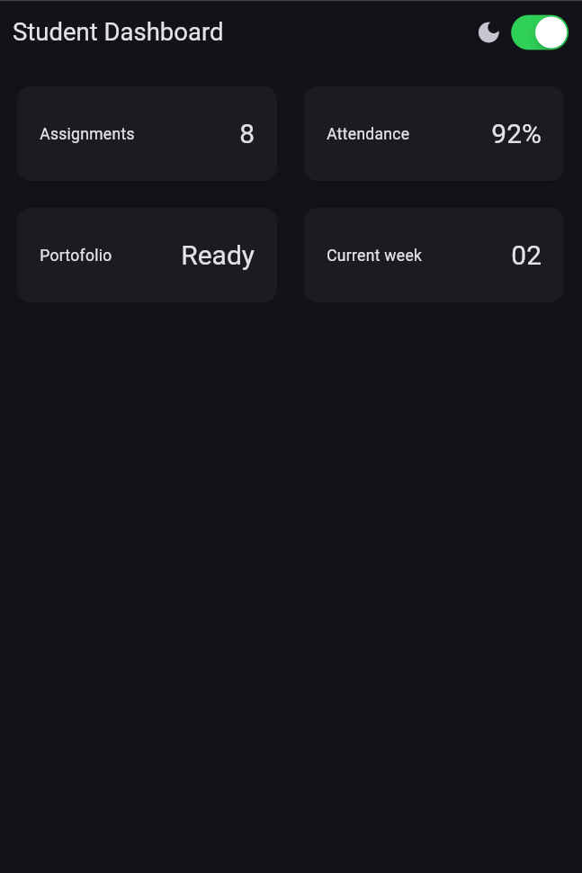
2. Ubah themeMode menjadi ThemeMode.dark, lalu kembalikan ke ThemeMode.system.
- jika diubah ke ThemeMode.dark maka tampilan di mode light menjadi seperti ini 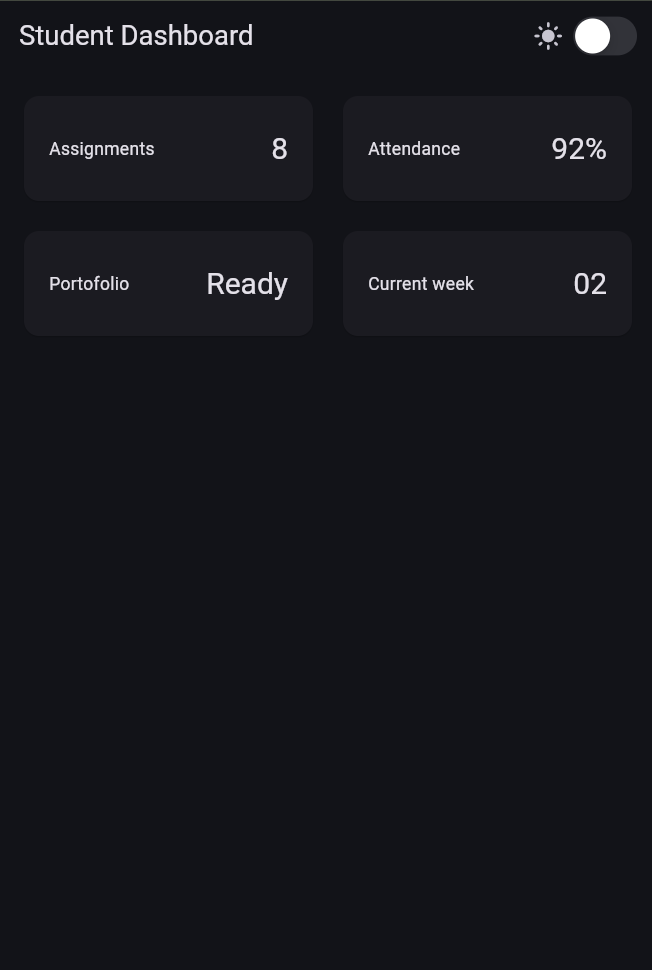, dan dikembalikan ke mode system 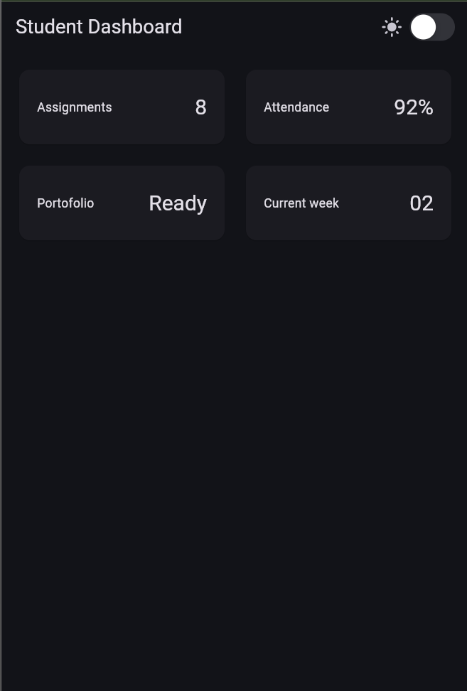
3. Uji aplikasi dengan ukuran layar emulator yang berbeda.
- 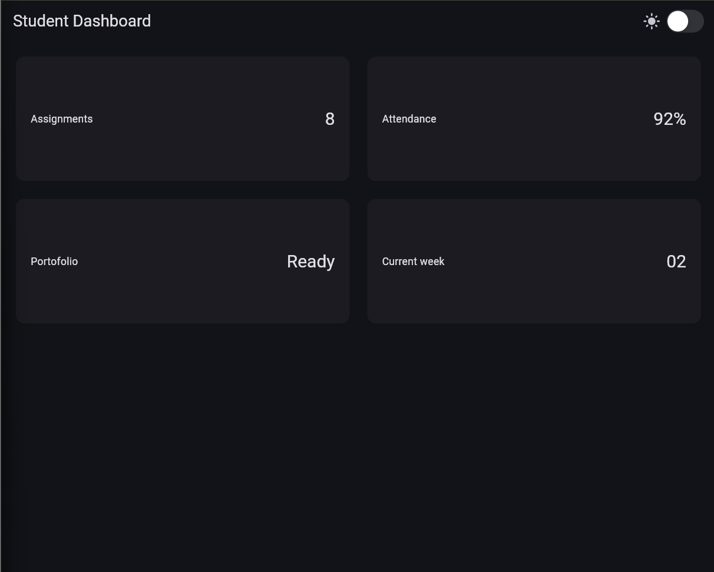
4. Tambahkan Semantics atau label yang bermakna pada elemen yang penting bagi screen reader.
  - Icon(isDark ? Icons.dark_mode : Icons.light_mode, semanticLabel: isDark ? 'Mode Gelap': 'Mode Terang',),
  - const SizedBox(width: 4),
  - Semantics(
    label: 'Beralih mode tema',
    value: isDark ? 'Dark' : 'Light',
    child: CupertinoSwitch(value: isDark, onChanged: onDarkChanged),
  ),

**Tugas dan AI design exploration**
1. - Memiliki header profil dan minimal empat kartu informasi.
   - Menggunakan Row, Column, Expanded, dan Container.
   - Menampilkan satu kolom pada layar sempit dan dua kolom pada layar lebar.
   - Menyediakan light theme dan dark theme yang tetap terbaca, dengan toggle tema (misal CupertinoSwitch atau Switch.adaptive).
   - Memiliki label aksesibilitas untuk informasi atau tombol penting.
   - Menyertakan screenshot layar sempit dan lebar pada folder screenshots/.
Hasil : 
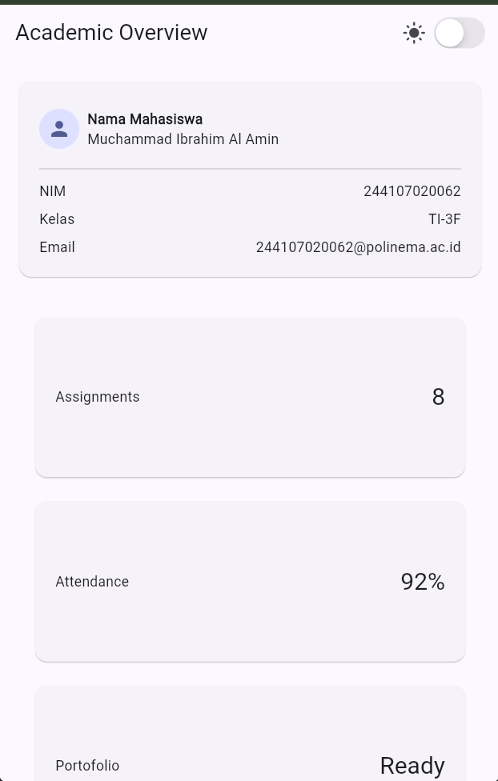, 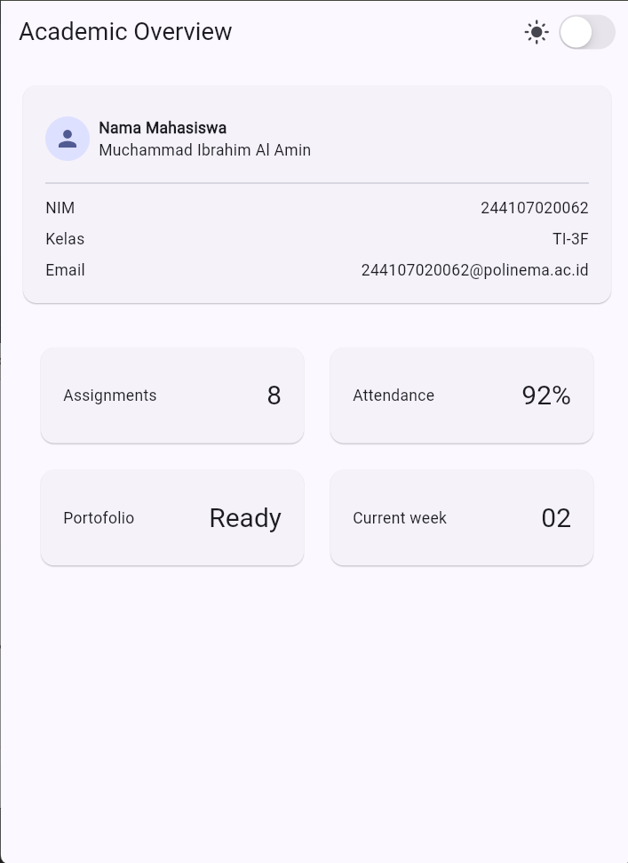

**AI Prompt Challenge**
1. Versi GridView
  • Responsif:
      • Tampilan otomatis rapi dan simetris (cocok untuk deretan angka metrik).
      • Kekurangan: Ukuran kartu kaku (childAspectRatio tetap). Kurang cocok jika isi kartu beda-beda
      panjangnya.
  • Aksesibilitas:
      • Kurang ramah: Jika pengguna memperbesar ukuran huruf HP (large text), teks di kartu mudah terpotong
      atau error garis kuning-hitam (overflow).
  Versi LayoutBuilder + Column
  • Responsif:
      • Sangat fleksibel: Tinggi kartu otomatis menyesuaikan isi teks (content-driven).
      • Mudah diubah polanya (misal: susun ke bawah di HP, sejajar ke samping di tablet/laptop).
  • Aksesibilitas:
      • Sangat ramah: Jika font sistem diperbesar, kartu akan memanjang ke bawah secara alami sehingga teks
      tidak akan pernah terpotong.
      • Alur baca screen reader lebih teratur dari atas ke bawah.
2. Penggunaan `Expanded` di dalam `Row` justru dapat menyebabkan overflow ketika **tinggi `Row` dibatasi secara kaku (*bounded height*)**. Saat teks panjang dilipat ke baris baru (*wrap*) oleh `Expanded`, teks tersebut meluap melebihi tinggi yang tersedia sehingga memicu **overflow vertikal di bagian bawah** (*A RenderFlex overflowed by X pixels on the bottom*). Selain itu, `Expanded` juga langsung memicu error jika dimasukkan ke dalam scroll horizontal (`SingleChildScrollView(scrollDirection: Axis.horizontal)`) karena lebar horizontalnya tak terhingga (*unbounded width*).

   **Contoh Kode Gagal:**
   ```dart
   SizedBox(
     height: 30, // Tinggi dibatasi terlalu sempit
     child: Row(
       children: const [
         Icon(Icons.info),
         SizedBox(width: 8),
         Expanded(
           // Teks melipat ke bawah melebihi tinggi 30px -> OVERFLOW BAWAH
           child: Text(
             'Pemberitahuan: Jadwal praktikum minggu ini diundur ke hari Jumat jam 13.00.',
           ),
         ),
       ],
     ),
   )
   ```

   **Perbaikan:**
   * **Opsi 1 (Batasi baris & beri elipsis jika tinggi harus tetap):**
     ```dart
     Expanded(
       child: Text(
         'Pemberitahuan: Jadwal praktikum minggu ini diundur ke hari Jumat jam 13.00.',
         maxLines: 1,
         overflow: TextOverflow.ellipsis,
       ),
     ),
     ```
   * **Opsi 2 (Hapus batasan tinggi agar kartu fleksibel memanjang ke bawah):**
     ```dart
     Padding(
       padding: const EdgeInsets.all(8.0),
       child: Row(
         crossAxisAlignment: CrossAxisAlignment.start,
         children: const [
           Icon(Icons.info),
           SizedBox(width: 8),
           Expanded(
             child: Text(
               'Pemberitahuan: Jadwal praktikum minggu ini diundur ke hari Jumat jam 13.00.',
             ),
           ),
         ],
       ),
     )
     ```

3. **Verification Prompt (Audit Mandiri AI):**
   * **Prompt:** *"Periksa kembali rekomendasi layout di atas: apakah tetap responsif di bawah 600px, apakah mengurangi aksesibilitas, dan apakah ada widget yang tidak tersedia di Flutter stabil saat ini?"*
   * **Hasil Audit:**
     - **Responsivitas (< 600px):** **Aman dan Responsif.** Pada layar di bawah 600px (seperti layar smartphone standar ~360–412px), `LayoutBuilder` secara dinamis menetapkan tata letak menjadi **1 kolom**. Penggunaan `ListView` membungkus seluruh konten sehingga halaman dapat di-scroll vertikal dengan lancar tanpa risiko terpotong atau overflow.
     - **Aksesibilitas:** **Tidak mengurangi aksesibilitas, justru meningkatkannya.**
       - Penggunaan `Expanded` pada kartu profil mencegah teks keluar batas layar dan fleksibel saat pengguna memperbesar font sistem (*system font scaling*).
       - Widget `CupertinoSwitch` dan ikon tema sudah dilengkapi metadata suara (`Semantics` dan `semanticLabel`) sehingga terbaca jelas oleh *Screen Reader* (TalkBack/VoiceOver).
       - Skema warna otomatis menyesuaikan Material 3 (`colorSchemeSeed: Colors.indigo`), menjaga rasio kontras teks tetap terbaca di Light maupun Dark Mode.
     - **Ketersediaan Widget di Flutter Stabil:** **Semua widget 100% tersedia di Flutter Stable.** Seluruh komponen (`LayoutBuilder`, `ListView`, `GridView`, `Card`, `Column`, `Row`, `Expanded`, `Semantics`, `CupertinoSwitch`, dll.) merupakan widget inti bawaan Flutter (`material.dart` dan `cupertino.dart`) tanpa dependensi paket eksternal atau API eksperimental.

4. **Dokumentasi Keputusan Teknis & Bukti Verifikasi:**
   * **Keputusan Desain & Layout yang Dipilih:**
     - Mengadopsi arsitektur hibrida: **`ListView`** sebagai scroll container utama, memadukan **`StudentProfileCard`** di bagian atas sebagai header profil dan **`GridView`** (dengan `shrinkWrap: true` & `physics: NeverScrollableScrollPhysics`) untuk kartu statistik akademik di bawahnya.
     - Menyediakan interaksi switch mode gelap/terang bergaya iOS menggunakan **`CupertinoSwitch`** dengan pembungkus **`Semantics`** di `AppBar`.
   * **Alasan Teknis:**
     - Kartu profil memiliki konten teks yang dinamis dan bertingkat (Nama, NIM, Kelas, Email) sehingga tidak cocok dimasukkan ke dalam `GridView` yang kaku rasionya.
     - Kartu statistik angka memiliki struktur seragam sehingga tetap optimal menggunakan `GridView` (1 kolom di layar < 700px, 2 kolom di layar >= 700px).
     - Menghindari konflik scroll dan *unbounded height crash* dengan menyetel `shrinkWrap: true` pada GridView di dalam ListView.
   * **Bukti Verifikasi:**
      - Tampilan layar sempit (1 kolom): `screenshots/tugas_layar_sempit.bmp`
      - Tampilan layar lebar (2 kolom): `screenshots/tugas_layar_lebar.bmp`
      - Interaksi tema (Light & Dark mode): `screenshots/praktikum_mode_terang.bmp` & `screenshots/praktikum_mode_gelap.bmp`

**Refactoring challenge**
- Jalankan flutter analyze dan pastikan tidak ada error maupun warning baru.
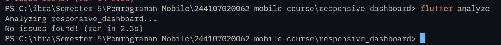
- Jalankan flutter test
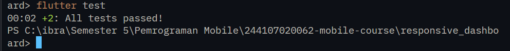

**Refleksi**
1. Apa perbedaan cara berpikir imperative dan declarative saat membangun UI?
- imperative membuat widget secara langkah demi langkah dan manual misal mencari elemen lalu memanggil fungsi ubah teks, sedangkan declarative hanya mendedskripsikan bentuk tampilan berdasarkan datanya jika data berubah flutter otomatis menggamabar ulang
2. Kapan Expanded membantu dan kapan penggunaannya justru menghasilkan layout error?
- expanded membantu ketika di dalam row dan column untuk mengisi sisa ruang kosong untuk mencegah overflow dan menghasilakn error jika memasukkan ke dalam widget scroll seperti listview
3. Bagaimana breakpoint dan theme memengaruhi pengalaman pengguna?
- breakpoint memengaruhi ukuran layar dan layout, sementara theme memengaruhi tampilan visual seperti warna dan font
4. Apa yang Anda verifikasi dari rekomendasi AI setelah tugas inti selesa?
- memastikan tidak ada garis kuning-hitam di layar sempit maupun lebarm dan memastikan warna tetap kontras di dark mode dan komponen memiliki labeh pembaca layar