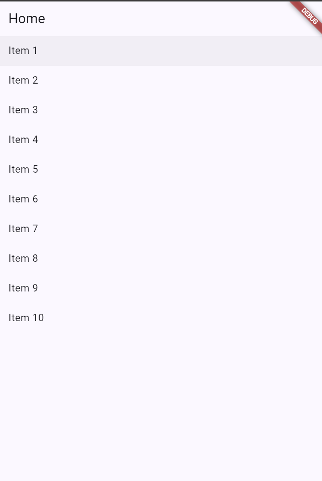
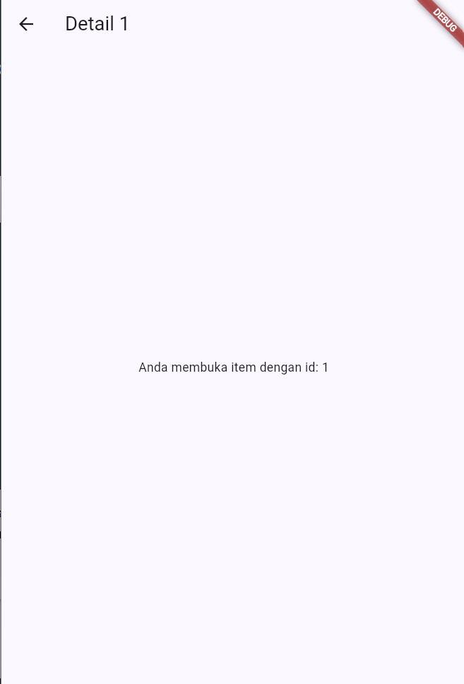
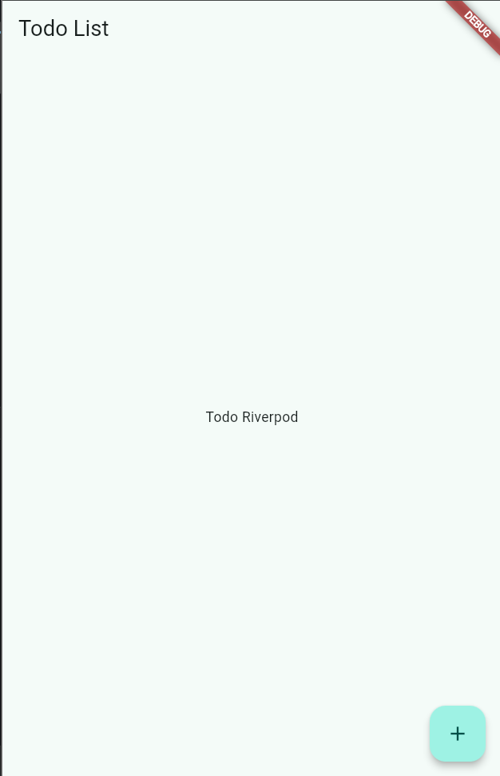
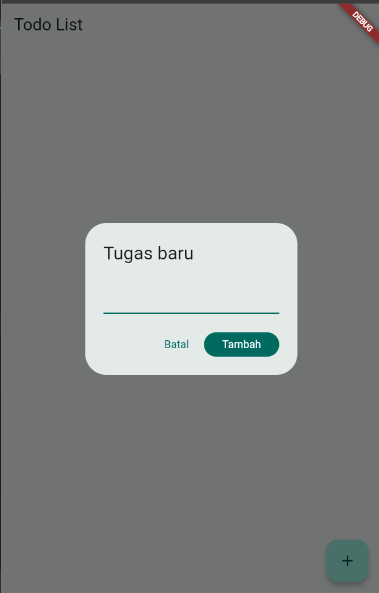
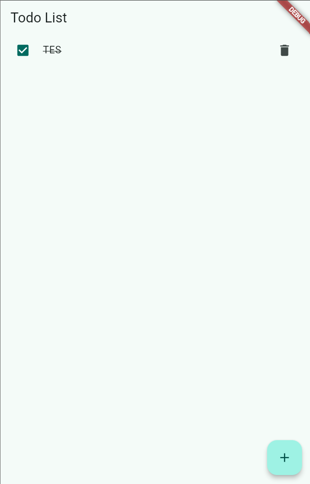
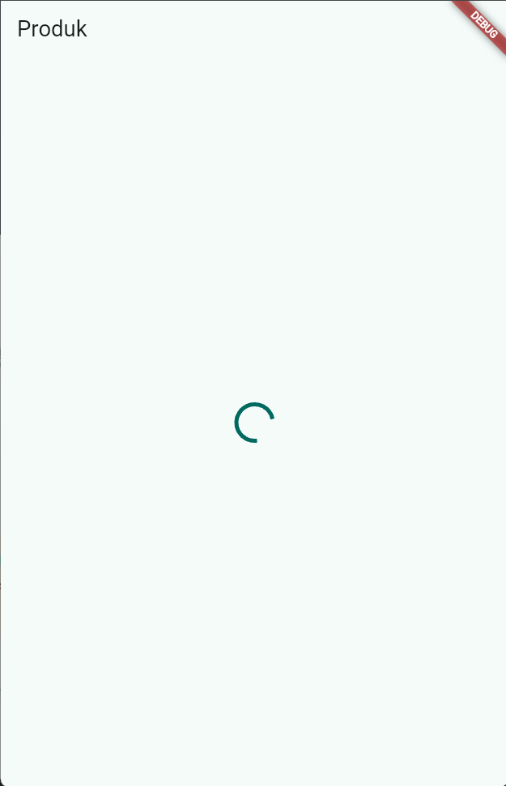
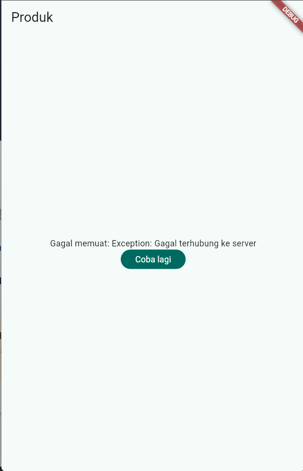
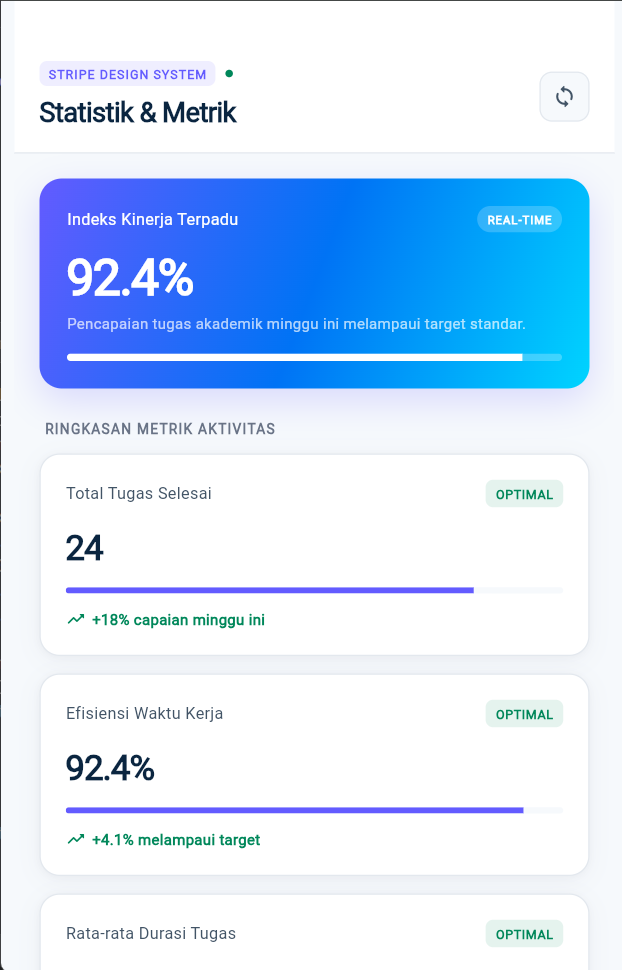
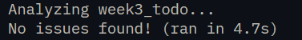
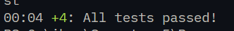

# Laporan Praktikum Minggu 3: Navigation & State Management
> **Mata Kuliah:** Pemrograman Mobile | **Semester:** Genap 2025/2026

---

### Identitas Mahasiswa
| Data | Keterangan |
| :--- | :--- |
| **Nama Lengkap** | Muchammad Ibrahim Al Amin |
| **NIM** | 244107020062 |
| **Kelas** | TI-3F |
| **Program Studi** | D-IV Teknik Informatika |
| **Jurusan** | Teknologi Informasi |
| **Institusi** | Politeknik Negeri Malang |

---


## Praktikum 1: Navigasi dengan GoRouter

### Tangkapan Layar Hasil Praktikum
| Halaman Utama (`/`) | Halaman Detail dengan Path Parameter (`/detail/:id`) |
| :---: | :---: |
|  |  |
| *Tampilan beranda berisi daftar item yang dapat diklik* | *Menampilkan ID item dinamis yang diekstrak dari URL rute* |

---

## Praktikum 2: Pengelolaan State dengan Riverpod

### Tangkapan Layar Hasil Praktikum
| Status Kosong (*Empty State*) | Dialog Input Tugas Baru | Daftar Tugas Terisi & Ceklis |
| :---: | :---: | :---: |
|  |  |  |
| *Indikator saat daftar tugas belum memiliki data* | *Modal dialog untuk memasukkan judul kegiatan baru* | *Item tugas berhasil ditambahkan dan dapat ditandai selesai* |

---

## Praktikum 3: State Asinkron dengan AsyncValue

### Tangkapan Layar Hasil Praktikum
| Kondisi Loading (Spinner) | Kondisi Error & Opsi Retry | Kondisi Sukses (Data Diterima) |
| :---: | :---: | :---: |
|  |  |  |
| *Indikator berputar saat data sedang diambil* | *Umpan balik kegagalan beserta tombol coba lagi* | *Penyajian data produk/statistik yang berhasil dimuat* |

**Mengapa menampilkan ulang data lama (stale data) dengan indikator refresh kadang lebih baik daripada mengosongkan layar? Kapan pola itu penting?**
--1. Tidak bikin layar kedip/putih: Pengguna tidak terganggu oleh layar kosong yang tiba-tiba muncul.
  2. Aplikasi terasa lebih cepat: Pengguna tetap bisa membaca data lama sambil menunggu pembaruan di latar belakang.
  3. Aman saat sinyal jelek: Jika koneksi tiba-tiba gagal, data lama masih bisa dilihat daripada langsung blank error.
  ──────
  Kapan pola ini penting?

  1. Fitur Pull-to-Refresh: Seperti feed Instagram atau Shopee saat ditarik ke bawah.
  2. Aplikasi Catatan / To-Do / Saldo: Menampilkan data dari memori HP dulu sebelum sinkron ke server.
  3. Data yang sering auto-refresh: Seperti grafik harga saham, cuaca, atau dashboard berkala. 

---

## AI Prompt Challenge

```text
Buatkan halaman Flutter bernama StatsPage menggunakan flutter_riverpod.
Requirements:
- ConsumerWidget dengan satu AsyncNotifierProvider yang mensimulasikan
  pengambilan data statistik (delay 2 detik, kadang gagal 30%).
- UI harus menangani loading (spinner), error (pesan + tombol retry),
  dan success (ListView 3 item).
- Berikan unit test untuk notifier-nya.
Jelaskan setiap bagian kode dalam komentar.
```

### Tangkapan Layar Hasil AI Prompt Challenge
| Tampilan Halaman StatsPage (Stripe Design System) |
| :---: |
|  |

---


## Refactoring Challenge

### Poin-Poin Refactoring Kode
Dalam rangka meningkatkan kualitas dan keterbacaan kode (*clean code*), sejumlah refactoring dilakukan:
1. **Modularitas Komponen (`TodoTile`)**:
   - Item baris daftar tugas dipisahkan ke dalam berkas tersendiri di `lib/widgets/todo_tile.dart`.
   - Menggunakan parameter modular (`todo`, `onToggle`, `onDelete`, `onTap`), menyederhanakan method `build` pada `TodoPage`.
2. **Pemisahan Provider Turunan (`filteredTodoListProvider`)**:
   - Logika pemfilteran tugas diekstraksi ke provider turunan (`Provider<List<Todo>>`) pada `lib/providers/todo_provider.dart`.
   - Menghilangkan komputasi filter dari lapisan widget UI, menjaga UI tetap deklaratif murni.
3. **Sentralisasi Konfigurasi Navigasi**:
   - Menata definisi rute dan wrapper `ScaffoldWithNavBar` ke dalam berkas arsitektur router tersendiri.
4. **Kepatuhan Standar Linter (`flutter analyze`)**:
   - Pengujian kode secara statis menghasilkan **0 issues / warnings**, menjamin kebersihan penulisan kode sesuai standar Flutter.

| Hasil Analisis Statis Kode (`flutter analyze`) |
| :---: |
|  |

---

## Pengujian Kode (Testing)

### Strategi Pengujian yang Diterapkan
Pengujian otomatis diterapkan pada dua tingkatan penting:
1. **Unit Testing Notifier (`test/unit_test.dart`)**:
   - Menguji logika bisnis `StatsNotifier` secara mandiri dan terisolasi menggunakan `ProviderContainer`.
   - Memastikan emisi data berhasil menghasilkan `AsyncData` dengan metrik kalkulasi yang tepat.
   - Menguji penanganan kegagalan jaringan simulasi agar menghasilkan `AsyncError` secara akurat.
2. **Widget Testing Reaktivitas UI (`test/widget_test.dart`)**:
   - Memverifikasi interaksi antarmuka pengguna terhadap mutasi state Riverpod.
   - Mensimulasikan input pengguna pada dialog tambah tugas dan memastikan item baru langsung ter-render pada daftar tanpa kesalahan layout.

Hasil pengujian otomatis menunjukkan seluruh skenario uji berhasil dilewati (**All tests passed!**):

| Hasil Eksekusi Unit & Widget Test (`flutter test`) |
| :---: |
|  |

---

## Checklist Verifikasi Praktikum

- [x] **Navigasi GoRouter**: Berpindah halaman, kembali (*back*), dan akses URL detail dengan path parameter berfungsi mulus.
- [x] **Persistensi State**: `ProviderScope` berada pada root aplikasi; status data ToDo tidak hilang saat berpindah antar halaman.
- [x] **Penanganan Asinkron Utuh**: Antarmuka menangani ketiga fase `AsyncValue` (loading, error dengan retry, dan success).
- [x] **Kualitas Kode**: Lolos `flutter analyze` dengan 0 peringatan (*clean linter*) dan lolos `flutter test`.
- [x] **Eksplorasi AI**: Hasil interaksi AI diverifikasi, disesuaikan, dan didokumentasikan dengan baik.

---

## Eksplorasi AI Prompt Challenge

Dokumentasi rinci disimpan pada berkas [docs/ai_challenge.md](docs/ai_challenge.md).

### Prompt yang Digunakan
```text
Buatkan halaman Flutter bernama StatsPage menggunakan flutter_riverpod.
Requirements:
- ConsumerWidget dengan satu AsyncNotifierProvider yang mensimulasikan
  pengambilan data statistik (delay 2 detik, kadang gagal 30%).
- UI harus menangani loading (spinner), error (pesan + tombol retry),
  dan success (ListView 3 item).
- Berikan unit test untuk notifier-nya.
Jelaskan setiap bagian kode dalam komentar.
```

### AI Verification Checklist (Temuan & Analisis)

| No | Poin Pemeriksaan dari Instruktur | Hasil Evaluasi | Analisis Temuan & Tindakan Perbaikan |
| :-: | :--- | :-: | :--- |
| **1** | **Apakah state diubah secara immutable** (tidak ada `state.add()` atau mutasi list langsung)? | **Lolos** | Mutasi state tidak memodifikasi objek secara in-place. Pada `StatsNotifier`, pembaruan list selalu mengembalikan salinan baru (`const [...]`), dan pada method `refresh()` digunakan `state = const AsyncLoading()` lalu `state = await AsyncValue.guard(...)`. |
| **2** | **Apakah `ref.watch` hanya dipakai di dalam `build()`, dan `ref.read` di callback?** | **Lolos** | `ref.watch(statsProvider)` hanya ditempatkan pada baris awal fungsi `build()` untuk me-rebuild UI secara reaktif. Sementara pemanggilan mutasi atau aksi seperti `ref.read(statsProvider.notifier).refresh()` dan `ref.invalidate(statsProvider)` murni berada di dalam event callback (`onPressed` dan `onRefresh`). |
| **3** | **Apakah ketiga state `AsyncValue` benar-benar ditangani** (bukan hanya success)? | **Lolos** | Menggunakan metode komprehensif `.when()` dari Riverpod: menangani `loading` dengan indikator spinner berputar, `error` dengan kartu pesan kesalahan serta tombol coba lagi (*retry*), dan `data` dengan ListView 3 item statistik. |
| **4** | **Apakah provider dideklarasikan dengan tipe eksplisit dan tidak duplikat dengan provider lain?** | **Lolos** | Provider dideklarasikan dengan tipe generic eksplisit: `AsyncNotifierProvider<StatsNotifier, List<StatItem>>(StatsNotifier.new)`. Penamaan `statsProvider` bersifat unik dan tidak tumpang tindih dengan provider lain di proyek. |
| **5** | **Apakah kode AI memakai API Riverpod versi lama** (StateProvider antipattern, StateNotifierProvider usang, atau Consumer bertingkat yang tidak perlu)? | **Diperbaiki** | Tidak menggunakan `StateProvider` maupun `StateNotifierProvider` usang, melainkan arsitektur Riverpod 2.x/3.x modern berbasis `AsyncNotifier` dan `ConsumerWidget`. Menghindari method usang `ref.refresh()` dengan menggantikannya ke `ref.invalidate()` yang dipadukan dengan `AsyncValue.guard()`. |
| **6** | **Jalankan `flutter analyze` dan `flutter test`, apakah hasil AI lolos tanpa warning?** | **Diperbaiki & Lolos** | Pada kode awal terdapat *flaky test* karena fungsi acak `Random()`, serta linter warning `withOpacity`. Telah diperbaiki dengan flag deterministik `forceErrorForTesting` dan migrasi ke `.withValues(alpha: ...)`. Hasil eksekusi akhir: `flutter test test/unit_test.dart` lulus 100% (**All tests passed!**) dan `flutter analyze` menghasilkan **No issues found!** (0 warnings). |

---

## Refleksi Pembelajaran

### 1. Kapan `setState` masih cukup, dan kapan state harus dipindahkan ke Riverpod?
> [!NOTE]
> **Prinsip Pembagian Tanggung Jawab State:**
> - **Gunakan `setState` (Ephemeral / Local State):** Sangat ideal untuk status sementara yang hanya relevan bagi satu widget tertentu dan tidak memengaruhi bagian lain dari aplikasi. Contoh: status teks sementara pada input field sebelum ditekan submit, status buka/tutup modal dialog lokal, atau animasi transisi sederhana pada sebuah tombol. Memaksakan Riverpod untuk hal-hal sepele seperti ini hanya akan menimbulkan *overengineering*.
> - **Gunakan Riverpod (Application / Shared State):** Wajib digunakan saat sebuah data dibutuhkan atau dimanipulasi oleh lebih dari satu halaman/komponen yang posisinya berjauhan pada widget tree (contoh: daftar tugas yang ditampilkan di beranda sekaligus dihitung pada halaman statistik). Riverpod juga krusial jika data harus tetap tersimpan saat widget di-*unmount*, atau saat logika aplikasi memerlukan pengujian otomatis (*unit test*) secara mandiri tanpa antarmuka grafis.

---

### 2. Apa perbedaan mendasar antara `context.go` dan `context.push`, serta kapan masing-masing tepat digunakan?
- **`context.go(path)` (Declarative / Route Stack Replacement):**  
  Bekerja dengan memetakan URL target ke konfigurasi pohon rute yang didefinisikan, menyesuaikan seluruh tumpukan halaman (*stack*) dengan hierarki path tersebut. Cocok dipakai untuk navigasi tingkat atas (*top-level navigation*), perpindahan tab utama pada `NavigationBar`, pengalihan halaman autentikasi/logout, serta penanganan *deep link*.
- **`context.push(path)` (Imperative Stack Layering):**  
  Bekerja dengan menumpuk halaman baru tepat di atas halaman aktif saat ini (*push to top of stack*), serupa dengan mekanisme `Navigator.push`. Pengguna dapat kembali ke halaman sebelumnya menggunakan tombol *back* standar. Sangat tepat digunakan untuk alur detail sementara atau formulir bertingkat (misalnya membuka rute `/detail/:id` dari daftar item).

---

### 3. Mengapa `AsyncValue` jauh lebih andal mencegah bug dibandingkan pendekatan tiga variabel boolean manual?
Pada pendekatan konvensional dengan variabel boolean manual:
```dart
bool isLoading = false;
bool hasError = false;
String? errorMessage;
dynamic data;
```
Pengembang wajib menyinkronkan status variabel-variabel ini secara manual pada setiap blok eksekusi. Pola ini sangat rentan *human error*, seperti lupa menyetel `isLoading = false` ketika terjadi exception pada blok `catch`, atau timbulnya kondisi tidak logis di mana `isLoading == true` dan `hasError == true` aktif bersamaan.

Sebaliknya, **`AsyncValue<T>`** dirancang sebagai sebuah *discriminated union*, artinya state hanya bisa berada di salah satu status eksklusif: `AsyncLoading`, `AsyncError`, atau `AsyncData`. Melalui metode `.when()`, kompiler Dart memberlakukan *exhaustive checking* saat *compile-time*. Jika ada satu skenario status yang terlewat ditangani, kode tidak akan dapat dikompilasi, sehingga menjamin keandalan UI secara mutlak.

---

### 4. Bagian mana dari kode rekomendasi AI yang Anda perbaiki, dan mengapa perbaikan tersebut penting?
1. **Penyelarasan Sumber Data Riil:**  
   Kode bawaan AI menghasilkan data statistik tiruan (*dummy*) yang tidak terhubung dengan aktivitas pengguna. Bagian ini diperbaiki dengan menyinkronkan `StatsNotifier` secara langsung ke `todoListProvider` melalui `ref.read(todoListProvider)` agar angka capaian tugas selalu merefleksikan data aktual ToDo.
2. **Pembaruan Sintaks Riverpod Modern:**  
   AI menyarankan penggunaan method `ref.refresh()` yang sudah terdepresiasi pada pola arsitektur Riverpod 2+. Hal ini diperbaiki dengan memanfaatkan `ref.invalidate(statsProvider)` yang dipadukan dengan method `refresh()` berbasis `AsyncValue.guard`.
3. **Pemberian Kontrol Deterministik untuk Pengujian:**  
   AI menggunakan generator probabilitas acak (`Random().nextInt(100) < 30`) untuk menyimulasikan kegagalan jaringan. Pola ini membuat unit test bersifat *flaky* (dapat lulus atau gagal secara tidak menentu saat di-run berkali-kali). Perbaikan dilakukan dengan menyematkan flag statis `forceErrorMode` sehingga pengujian unit test dan demo antarmuka dapat memicu status kesalahan secara terprediksi.
4. **Peningkatan Standar Desain Material 3:**  
   Implementasi visual awal dari AI hanya menyusun widget `ListTile` biasa. Tampilan tersebut disempurnakan menggunakan komponen `Card` tematik Material 3 dengan tata warna yang lebih informatif, ikon status visual, dan atribut aksesibilitas yang ramah pengguna.
